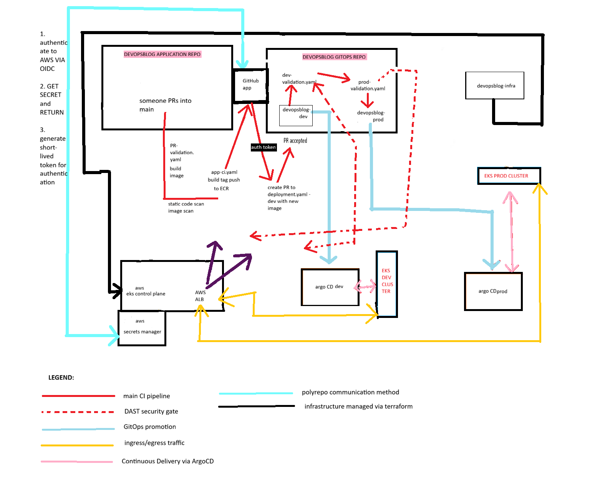
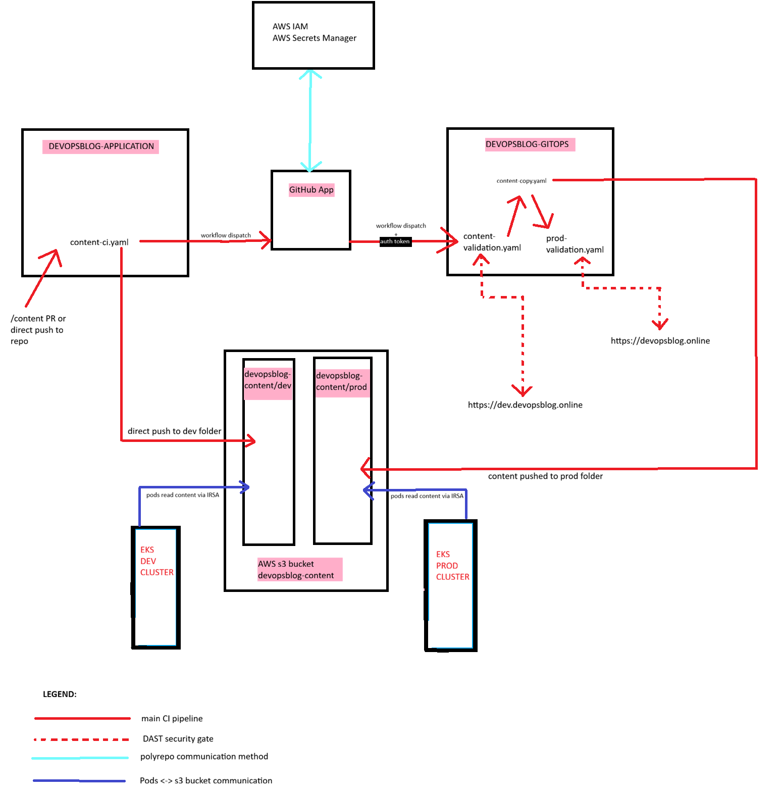

# DevOpsBlog — Application Repository

## Overview
This repository contains the DevOpsBlog Flask application and the CI workflows used to validate, build, and publish the images.

This repo includes:
- Flask application source code
- Blog content sources under `content/`
- Dockerfile and Python dependencies
- GitHub Actions workflows for CI (PR validation and the main pipeline)

This repo does not include:
- Kubernetes manifests (owned by the GitOps repository)
- Infrastructure/Terraform code

## How the application works
- The application is containerized and deployed to Kubernetes (EKS).
- Blog content is not baked into the image. At runtime the app loads posts from Amazon S3.
- The app exposes:
  - `/health` for readiness/liveness
  - `/posts` for listing posts

## Run locally

### Prerequisites
- Python 3.x
- Optional: Docker

### Run with Python
```bash
python -m venv .venv
source .venv/bin/activate
pip install -r requirements.txt
python app.py
```
### Run with Docker

```bash
docker build -t devopsblog .
docker run -p 8000:8000 devopsblog
```
## CI/CD

### Pull Requests

On pull requests, the autobot-merge.yaml and pr-validation workflows run at the same time:

pr-validation.yaml:
- SonarCloud analysis  
- Snyk scans (dependency and container)    

autobot-merge.yaml
enables auto-merge after checks pass on the pull request

---

PR is auto-merged thanks to autobot-merge.yaml

---

### On merge to `main`

On merge to `main`, the main workflow:

- Builds the Docker image  
- Pushes the image to Amazon ECR using OIDC (no long-lived AWS keys)  
- Captures the immutable image digest  
- Creates a pull request to the GitOps repository to update the dev deployment to the new digest thanks to a short-lived token generated by the GitHub app

---

## Content Updates

When files under `content/**` change:

- Content is uploaded to S3 under the **dev** prefix via content-ci.yaml
- A GitOps workflow (content-validation.yaml) is triggered inside the GitOps repo via the same workflow

---

## Security Notes

- No secrets are stored in this repository  
- AWS authentication is handled via GitHub OIDC  
- Runtime access to S3 is handled via IRSA in Kubernetes  
- HTTPS is terminated at the ALB and enforced via redirect
- Cross-repo authentication is made possible via GitHub App  

---

## Related Repositories

- **GitOps repository**  
  Contains Kubernetes manifests, Argo CD Applications, validation, and promotion workflows  

- **Terraform / Infrastructure repository**  
  Used for AWS and EKS provisioning (not executed via CI)

  ## Architecture/Workflow Overview





